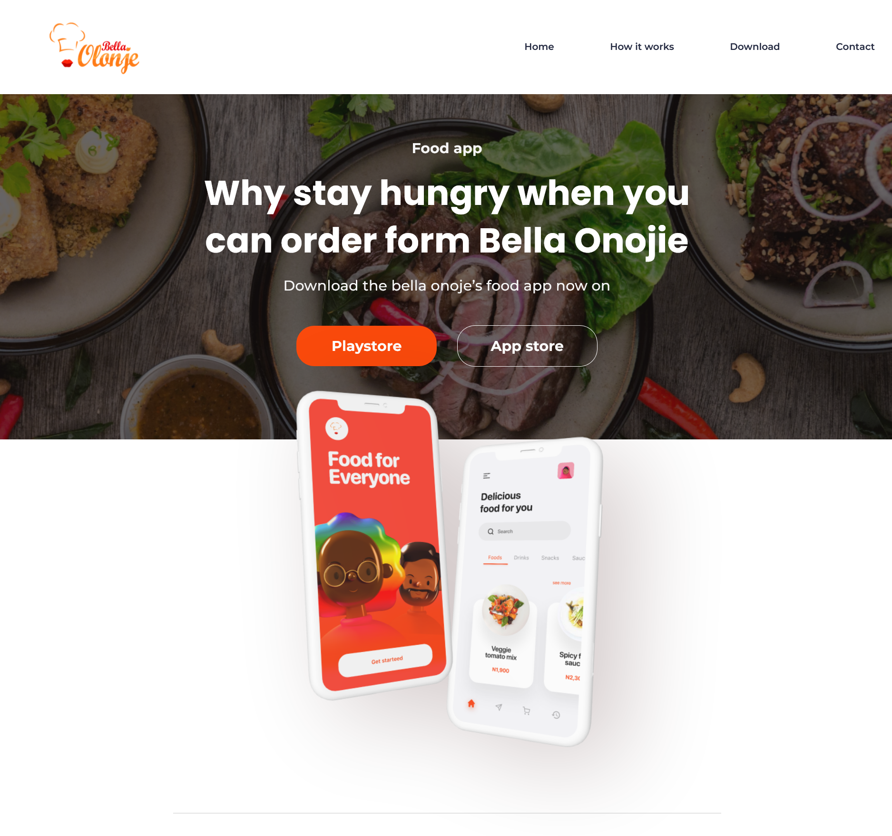
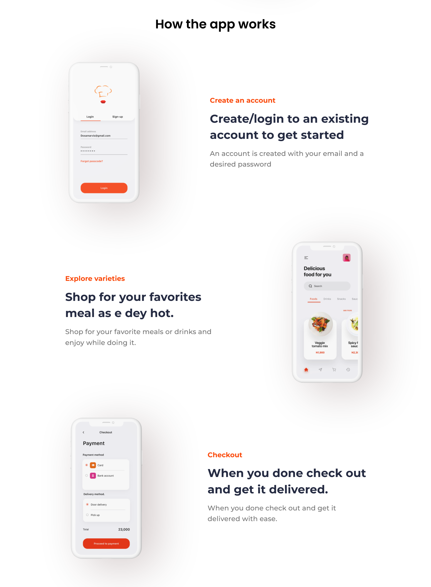
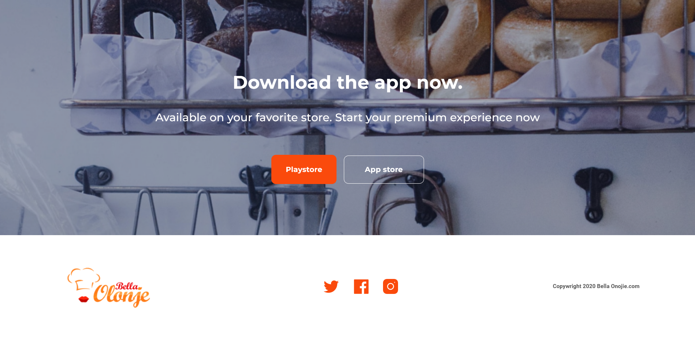

# Food App

Food app. Why stay hungry when you can order from Bella Olonje. Download our food app now on. Playstore App store. How the app works. Create an account.

## Table of contents

- [Overview](#overview)
  - [The challenge](#the-challenge)
  - [Screenshot](#screenshot)
  - [Links](#links)
- [My process](#my-process)
  - [Built with](#built-with)
- [Author](#author)
- [Acknowledgments](#acknowledgments)

## Overview

### The challenge

Users should be able to:

- See and experience modern website design

### Screenshot

### Links

- Live Site URL: 

## My process

### Built with

- HTML5
- Sass
- Parcel Bundler

## Author

- GitHub - [quielLovesLasagna](https://github.com/quielLovesLasagna)

## Acknowledgments

I would like to thank **Emmax** for sharing the UI design for this project. Check it out [here](https://dev.to/emmanx/free-figma-ui-designs-for-frontend-practice-3ak2?fbclid=IwAR3avsE_M9ipHrkFuJp7PxZbCH9gDvfF4G7mvKFZ7ZUoLUXvrYEy2-QF6CM)
